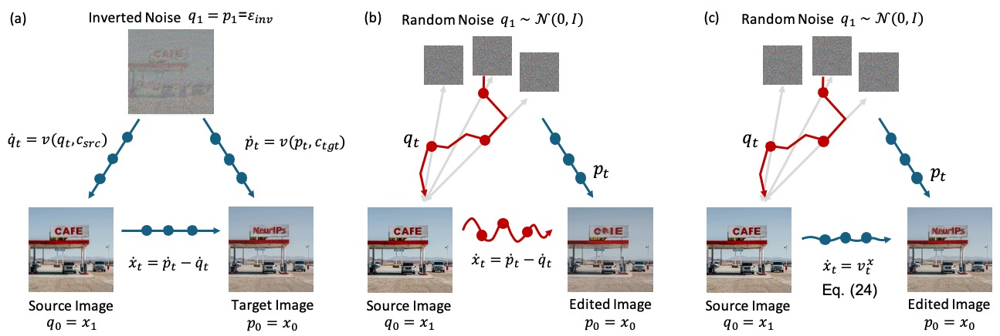
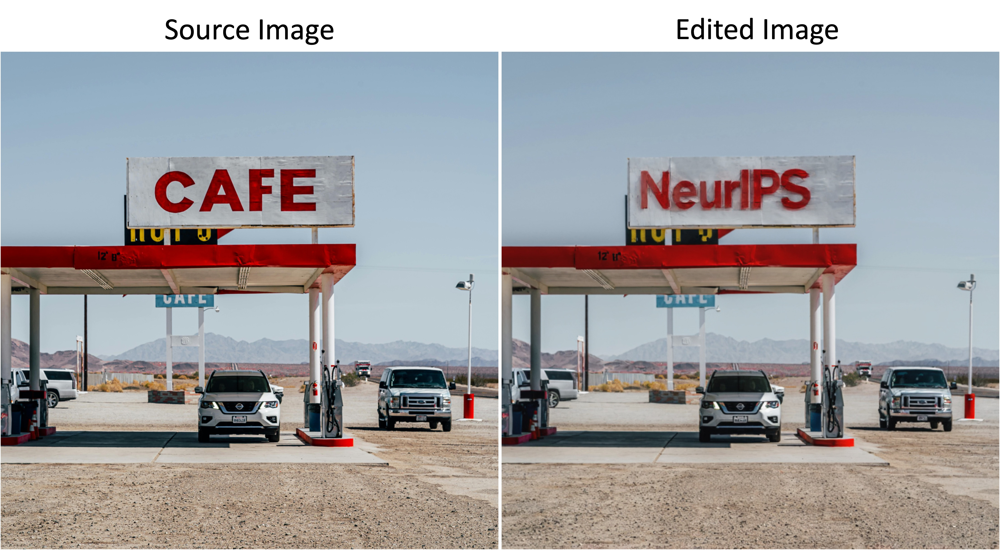
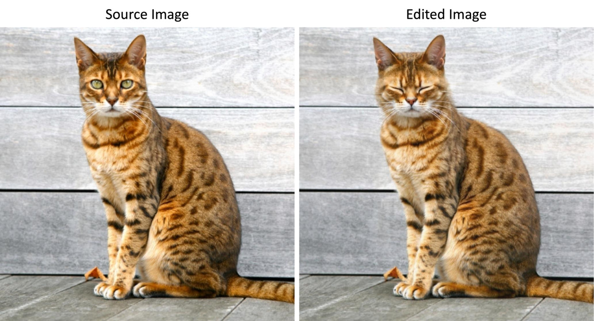

# FlowAlign: Trajectory-Regularized, Inversion-Free Flow-based Image Editing

This repository is the official implementation of FlowAlign, an inversion & training free image editing algorithm. 



### Abstract

💡 Recent inversion-free, flow-based editors leverage models like Stable Diffusion 3 to enable text-driven image editing via ODE integration.

🤔 However, skipping latent inversion often leads to unstable trajectories and poor source consistency.

🚀 **FlowAlign** addresses this by introducing a flow-matching loss—a simple yet effective regularizer that ensures smooth, semantically aligned, and structurally consistent edits.

🌟 Thanks to its ODE-based formulation, FlowAlign naturally supports reverse editing, highlighting its reversible and robust transformation capability.

## Requirements

Clone this repo:
```
git clone https://github.com/FlowAlign/FlowAlign.git
cd FlowAlign
```

To install requirements:

```
conda create -n flowalign python==3.11
conda activate flowalign
pip install torch==2.1.2+cu118 torchvision==0.16.2+cu118 --extra-index-url https://download.pytorch.org/whl/cu118
pip install -r requirements.txt
```

## Quick Start
For the text-based image editing, run:

**Examples 1**
```
python run_edit.py \
  --img_path samples/gas_station.jpg \
  --src_prompt "A gas station with a white and red sign that reads "CAFE" There are several cars parked in front of the gas station, including a white car and a van." \
  --tgt_prompt "A gas station with a white and red sign that reads "NeurIPS" There are several cars parked in front of the gas station, including a white car and a van."
```

The expected result:




**Example 2**

```
python run_edit.py \
  --img_path samples/raw_meat.jpg \
  --src_prompt "a photo of raw meat with herb on it"
  --tgt_prompt "a photo of raw salmon with herb on it";
```

The expected result:




## How to choose editing methods

You can freely change the editing method using arguments:
- `method` : dual / sdedit / flowedit / flowalign


## Efficient inference

If you use `--efficient_memory`, text encoder will pre-compute text embeddings and is removed from the GPU.

This allows us to run image editing with a single GPU with VRAM 24GB.

<!-- 
## Pre-trained Models

You can download pretrained models here:

- [My awesome model](https://drive.google.com/mymodel.pth) trained on ImageNet using parameters x,y,z. 

>📋  Give a link to where/how the pretrained models can be downloaded and how they were trained (if applicable).  Alternatively you can have an additional column in your results table with a link to the models.

## Results

Our model achieves the following performance on :

### [Image Classification on ImageNet](https://paperswithcode.com/sota/image-classification-on-imagenet)

| Model name         | Top 1 Accuracy  | Top 5 Accuracy |
| ------------------ |---------------- | -------------- |
| My awesome model   |     85%         |      95%       |

>📋  Include a table of results from your paper, and link back to the leaderboard for clarity and context. If your main result is a figure, include that figure and link to the command or notebook to reproduce it. 


## Contributing

>📋  Pick a licence and describe how to contribute to your code repository.  -->
