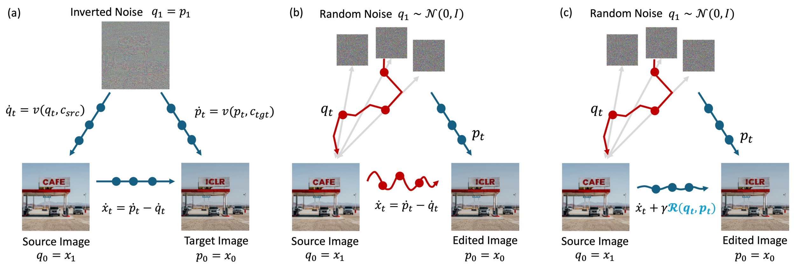

# FlowAlign: Trajectory-Regularized, Inversion-Free Flow-based Image Editing

This repository is the official implementation of FlowAlign, an inversion & training free image editing algorithm. 



### Abstract

:bulb: Recent inversion-free, flow-based image editing methods such as FlowEdit leverages a pre-trained noise-to-image flow model such as Stable Diffusion 3, 
enabling text-driven manipulation by solving an ordinary differential equation (ODE). 

:thinking: While the lack of exact latent inversion is a core advantage of these methods, it often results in unstable editing trajectories and poor source consistency.

:rocket: To address this limitation, we propose {\em FlowAlign} that introduces a flow-matching loss as a regularization mechanism to promote smoother and more stable trajectories during the editing process. Notably, the flow-matching loss is shown to explicitly balance semantic alignment with the edit prompt and structural consistency with the source image along the trajectory. 

:star_struck: Furthermore, FlowAlign naturally supports reverse editing by simply reversing the ODE trajectory, highliting the reversible and consistent nature of the transformation.

:test_tube: Extensive experiments demonstrate that FlowAlign outperforms existing methods in both source preservation and editing controllability.

## Requirements

Clone this repo:
```
git clone https://github.com/FlowAlign/FlowAlign.git
cd FlowAlign
```

To install requirements:

```
conda create -n flowalign python==3.11
pip install -r requirements.txt
conda activate flowalign
```

## Quick Start
For the text-based image editing, run:

```
python run_edit.py
```

The expected result is below.


## How to choose editing methods

You can freely change the editing method using arguments:
- `method` : dual / sdedit / flowedit / flowalign


## Efficient inference

If you use `--efficient_memory`, text encoder will pre-compute text embeddings and is removed from the GPU.

This allows us to solve inverse problem with a single GPU with VRAM 24GB.

<!-- 
## Pre-trained Models

You can download pretrained models here:

- [My awesome model](https://drive.google.com/mymodel.pth) trained on ImageNet using parameters x,y,z. 

>📋  Give a link to where/how the pretrained models can be downloaded and how they were trained (if applicable).  Alternatively you can have an additional column in your results table with a link to the models.

## Results

Our model achieves the following performance on :

### [Image Classification on ImageNet](https://paperswithcode.com/sota/image-classification-on-imagenet)

| Model name         | Top 1 Accuracy  | Top 5 Accuracy |
| ------------------ |---------------- | -------------- |
| My awesome model   |     85%         |      95%       |

>📋  Include a table of results from your paper, and link back to the leaderboard for clarity and context. If your main result is a figure, include that figure and link to the command or notebook to reproduce it. 


## Contributing

>📋  Pick a licence and describe how to contribute to your code repository.  -->
